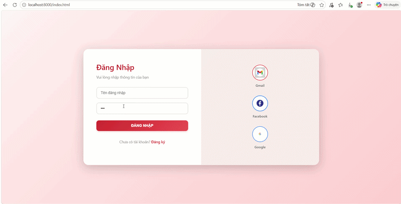

# 🛡️ Website Description

This web application is built for educational and security research purposes, focusing on demonstrating common web vulnerabilities based on the OWASP Top 10.

It provides a controlled environment where learners can understand how vulnerabilities are exploited in real-world scenarios, as well as how to identify and mitigate them.

### 🔍 Key Features

- **SQL Injection (SQLi) Demonstration**  
  Simulate SQL Injection attacks to understand how improper input validation can lead to data leakage and authentication bypass.

- **Authentication & Authorization Flaws**  
  Explore common weaknesses in login systems and access control mechanisms.

- **Cross-Site Scripting (XSS)**  
  Demonstrate how user input can be injected and executed in the browser.

- **Sensitive Data Exposure**  
  Highlight risks caused by improper configuration and exposed sensitive information.

- **Interactive Learning Environment**  
  Users can directly interact with the system to observe the impact of each vulnerability in real time.

---

## ⚙️ Technologies Used

- **Frontend**: HTML, CSS, JavaScript  
- **Backend**: Python (Flask)  
- **Database**: MySQL  

---

## 🚀 Getting Started

1. Clone the repository  
2. Configure environment variables using `.env.example`  
3. Set up MySQL database  
4. Run the Flask application  

---

## 🎥 Vulnerability Demonstrations

### 🔴 SQL Injection

---

### 🟠 High-Level Logic Vulnerability

---

### 🟡 Stored XSS

---

### 🔵 Sensitive Configuration Leak

---

### 🟣 Broken Authentication

---

### ⚫ Broken Access Control

